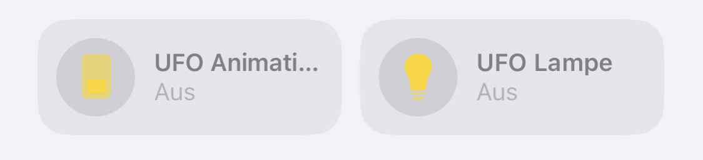

# esp8266-native-homekit-animation-lamp
A shelf just to put it down. :LOLESP8266 Native WS2812B Lamp

Deswegen:

Code ist Crap aber er funktioniert. Wollte eigentlich nur kurz was testen und lege es hiermit als kleines Template für die Zukunft ab. Wenn ich lust und need habe werde ich das cleanen und besser dokumentieren!einself!1


### Was macht dieser Code? 

Er verwandelt euren ESP8266 in eine Native HomeKit Lampe. 
Diese hat zwei Funktionen:

1. einfache RGB Lampe
2. abspielen von Animationen der WS2812B LEDS


### Verdrahtung

DATA PIN LEDS: **D4**


### Bibliotheken

- [Arduino-HomeKit-ESP8266](https://github.com/Mixiaoxiao/Arduino-HomeKit-ESP8266)
- [Adafruit_NeoPixel](https://github.com/adafruit/Adafruit_NeoPixel)
- [FastLED](https://github.com/FastLED/FastLED)


Eigentlich will ich alles auf FastLED haben aber hab das jetzt nicht umgesetzt, da das LED Example direkt aus [Arduino-HomeKit-ESP8266](https://github.com/Mixiaoxiao/Arduino-HomeKit-ESP8266) kommt und da leider mit NeoPixel gearbeitet wurde.

FastLED wird nur für die Animation verwendet.


### Anpassungen im Code

Passt folgende Zeilen auf eure Bedürfnisse an ...

`Main.ino`

```arduino
#define NEOPIN                D4
#define NUMPIXELS             43
```


`wifi.ino`

```arduino
const char *ssid = "WLAN-SSID";
const char *password = "WLAN-PSK";
```

 


## Upload

Ich hatte zuerst Probleme mit dem Pairing, aber es kann sein, dass das von dem vorherigen HomeKit Code kam. Falls ihr auch Probleme beim Pairing habt, ist es ratsam den Flash des ESP's komplett zu löschen und alles neu hochzuladen, das geht in den Werkzeugen:

`Erase Flash -> All Flash Content`


Desweiteren benötogt ESP8266 Homekit sehr viel Leistung, da verschlüsselt. Übertaktet den ESP8266, um Ausfälle zu vermeiden. Das geht ebenfalls über die Werkzeuge:

`CPU Frequency -> 160 MHz`  


### Pairing


Der ESP8266 fungiert als Bridge und stellt 2 Accessories bereit:




Namen können in `my_accessory.c` geändert werden. Oder einfach beim Pairen mit der Home App.


 